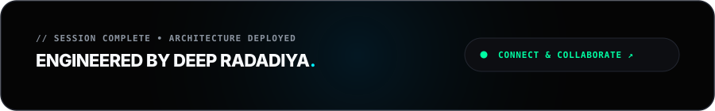

<!-- ========================================================= -->
<!--        OBSIDIAN // AETHER ENGINEERING CONSOLE             -->
<!-- ========================================================= -->

  

 

  
  
  
  

 

  

  

 

  

  

 

  

<!-- ========================================================= -->
<!--               OPEN SOURCE SIGNAL & ANALYTICS              -->
<!-- ========================================================= -->

  

 

  
  

    

  

  

<!-- ========================================================= -->
<!--             CONTRIBUTION VELOCITY & ACTIVITY              -->
<!-- ========================================================= -->

  

 

  

  

<!-- ========================================================= -->
<!--             INTERACTIVE CONTRIBUTION SNAKE                -->
<!-- ========================================================= -->

  

 

  

 

  

  

 
